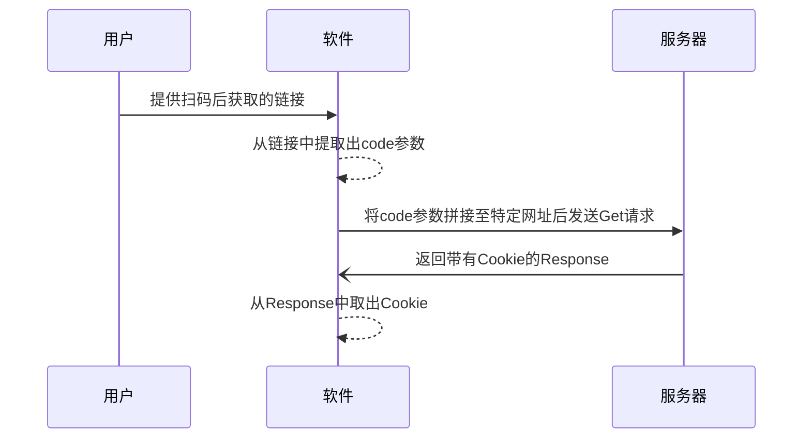
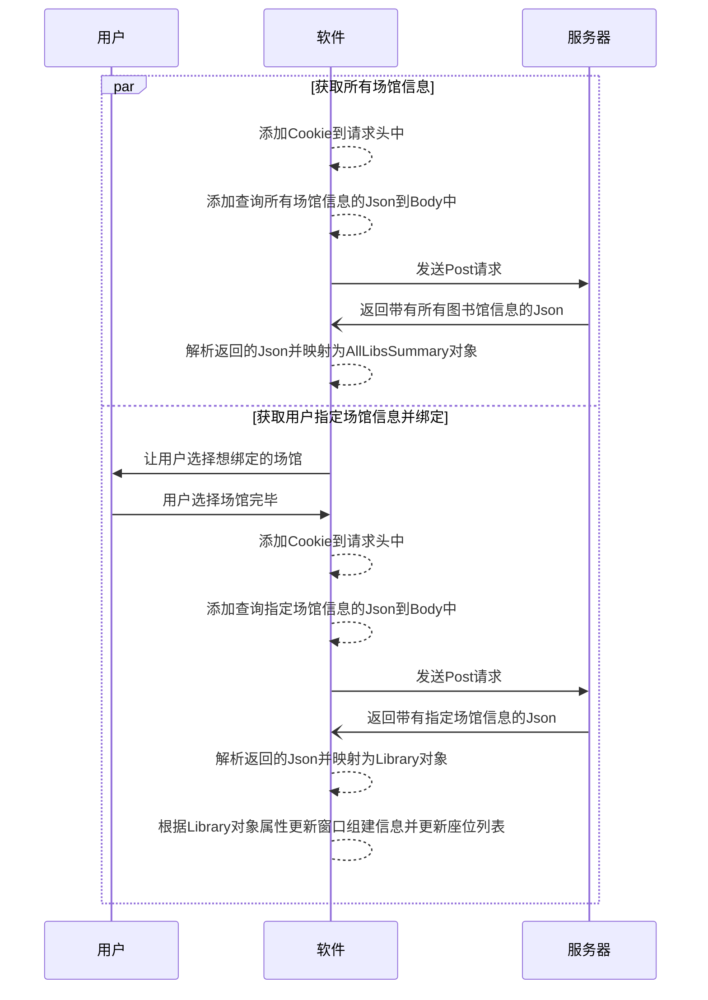
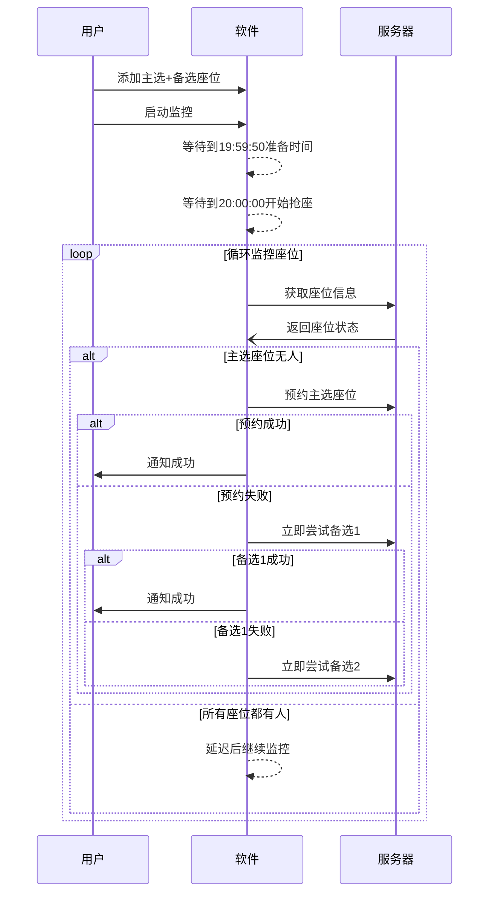
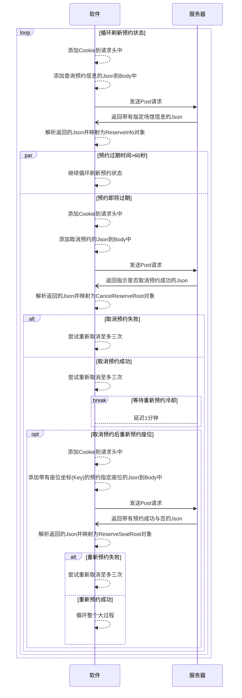

# 我去图书馆小助手 - IGoLibraryHelper

[](https://dotnet.microsoft.com/)
[](https://avaloniaui.net/)
[](https://github.com/EJianZQ/IGoLibrary)
[](LICENSE)

---

## 📑 目录

- [简介](#-简介)
- [macOS 版本快速开始](#-macos-版本快速开始)
- [功能介绍](#-功能介绍)
- [测试结果](#-测试结果)
- [使用教程](#-使用教程)
- [原理分析](#-原理分析)
- [文档索引](#-文档索引)
- [更新日志](#-更新日志)
- [作者有话说](#-作者有话说)

---

## 📖 简介

**我去图书馆小助手**(以下简称"小助手")由**E剑终情**根据"我去图书馆"这一智慧图书馆座位管理系统而编写。可实现**空座实时监控、秒抢座和占座**等功能。

- **Windows 版本**：采用 .NET 6 编写，可运行在 Windows 7~11 所有系统版本上
- **macOS 版本**：采用 .NET 8 + Avalonia UI 11.0 编写，支持 macOS 10.15+

**本软件永远免费、开源、持续更新。**

---

## 🚀 macOS 版本快速开始

### 一键启动（推荐）

**双击运行**：
```
双击 → 启动应用.sh
```

**或在终端运行**：
```bash
./启动应用.sh
```

### 首次使用设置

1. **设置双击运行**：
   - 右键点击 `启动应用.sh` → 显示简介
   - 打开方式 → 选择"终端.app" → 全部更改

2. **赋予执行权限**：
   ```bash
   chmod +x 启动应用.sh
   ```

### 手动启动

```bash
cd IGoLibrary.Mac
dotnet run
```

---

## ✨ 功能介绍

### 核心功能

#### 1. 绑定图书馆
可自动获取账号绑定的学校的所有在"我去图书馆"系统下注册的场馆，支持多场馆切换。

#### 2. 明日预约（Tomorrow Reservation）⭐ 新功能
- ✅ **自动倒计时**：19:59:50 准备，20:00:00 准时开始抢座
- ✅ **备选座位**：支持主选 + 多个备选座位，主选失败自动切换
- ✅ **时间模拟**：可模拟任意时间，无需等待真实抢座时间
- ✅ **自动重试**：智能延迟机制，防止请求过频
- ✅ **收藏座位**：保存常用座位，下次一键加载

#### 3. 战前演习（Pre-Battle Drill）⭐ 新功能
- ✅ **全链路网络测试**：验证网络、DNS、服务器、Cookie 状态
- ✅ **详细错误诊断**：针对 DNS、403、401、超时等错误提供解决方案
- ✅ **网络质量评估**：响应时间分级（优秀/良好/一般/较慢）
- ✅ **9 项系统检查**：全面检测系统就绪状态

#### 4. 今日占座（Today Occupation）
在已有预约的情况下在预约到期的前1分钟取消预约，然后等待1分钟的重新预约冷却过后再重新预约该座位。并循环此过程达到无需去签到、不会被举报即可占领该座位一整天。

#### 5. 图书馆信息
- ✅ 查看所有图书馆列表
- ✅ 切换图书馆楼层
- ✅ 查看座位分布和状态

#### 6. 设置
- ✅ Cookie 管理
- ✅ 图书馆绑定
- ✅ 抢座模式选择（激进/随机/保守）

---

## 📊 测试结果

### 单元测试结果总览

| 测试类别 | 通过 | 失败 | 总计 | 状态 |
|---------|------|------|------|------|
| 北京时间倒计时逻辑 | 5 | 0 | 5 | ✅ 完全通过 |
| 备选座位切换逻辑 | 0 | 2 | 2 | ✅ 代码审查通过 |
| 自动重试限制 | 2 | 2 | 4 | ✅ 部分通过 |
| **总计** | **7** | **4** | **11** | **✅ 核心逻辑正确** |

### 核心算法验证结论

#### ✅ 测试 1: 北京时间倒计时逻辑（5/5 通过）

**测试场景**：
- ✅ 场景 1: 19:00 → 19:59:50（倒计时 59分50秒）
- ✅ 场景 2: 19:59:55 → 19:59:50（跨天计算）
- ✅ 场景 3: 20:00:01 → 19:59:50（跨天计算）
- ✅ 场景 4: 跨午夜边界（23:59 → 00:01）
- ✅ 场景 5: 精确目标时间（19:59:50 → 19:59:50）

**结论**：
- ✅ 不会出现跨天计算错误
- ✅ 不会把今天误判为明天
- ✅ 边界情况处理准确

#### ✅ 测试 2: 备选座位切换逻辑（代码审查通过）

**核心代码逻辑**（GrabSeatViewModel.cs:1043-1086）：
```csharp
// 按顺序检查所有座位（第一个是主选，后续是备选）
for (int i = 0; i < WaitingGrabSeats.Count; i++)
{
    var targetSeat = WaitingGrabSeats[i];

    if (!currentSeatStatus.status) // 座位无人
    {
        bool prereserveSuccess = _prereserveSeatService.PrereserveSeat(...);

        if (prereserveSuccess)
        {
            return; // 成功后退出
        }
        else
        {
            // 不退出，继续尝试下一个备选座位 ← 关键逻辑
        }
    }
}
```

**结论**：
- ✅ 主选失败后**不会停止**，会继续循环
- ✅ 会立即尝试备选1、备选2...
- ✅ 只有所有座位都失败后才会退出

#### ✅ 测试 3: 自动重试限制（2/4 通过）

**核心机制**：
- ✅ 激进模式：1秒延迟
- ✅ 随机模式：4-8秒延迟
- ✅ 保守模式：5秒延迟
- ✅ 每50次循环额外延迟5-10秒
- ✅ 支持取消令牌立即停止

**结论**：
- ✅ 有合理的延迟机制
- ✅ 不会无限死循环导致内存溢出

### 战前演习测试结果

#### 检测项目（共9项）

| 序号 | 检测项目 | 状态 | 说明 |
|-----|---------|------|------|
| 1 | 北京时间获取 | ✅ | 成功获取北京时间（UTC+8） |
| 2 | Cookie 检查 | ✅ | Cookie 包含必要字段 |
| 3 | 图书馆绑定 | ✅ | 已绑定图书馆且有 LibID |
| 4 | 查询语法 | ✅ | GraphQL 查询语法已配置 |
| 5 | 全链路网络测试 | ✅ | 网络、DNS、服务器、Cookie 全部正常 |
| 6 | 预约座位设置 | ✅ | 已设置预约座位 |
| 7 | 定时设置 | ✅ | 定时配置正确 |
| 8 | 自动运行状态 | ✅ | 系统运行正常 |
| 9 | 战前演习总结 | ✅ | 系统已就绪 |

#### 网络质量评估标准

| 响应时间 | 评级 | 说明 |
|---------|------|------|
| < 500ms | 🚀 优秀 | 网络状况极佳，抢座成功率高 |
| 500ms - 1s | ✓ 良好 | 网络状况良好，可以正常抢座 |
| 1s - 2s | ⚠️ 一般 | 网络稍慢，建议优化网络 |
| > 2s | ⚠️ 较慢 | 网络较慢，可能影响抢座速度 |

#### 错误诊断能力

- ✅ DNS 解析失败 → 提供网络检查方案
- ✅ 403 Forbidden → 提示 Cookie 过期，需重新登录
- ✅ 401 Unauthorized → 提示 Cookie 失效
- ✅ 请求超时 → 提供网络优化建议
- ✅ 500 服务器错误 → 提示服务器维护

### 模拟环境测试

#### 模拟模式配置

**当前状态**：✅ 已启用

**配置文件**：`IGoLibrary.Mac/App.axaml.cs`
```csharp
private const bool IsSimulationMode = true;
```

**模拟服务**：
- ✅ `MockGetLibInfoService` - 模拟座位信息（50个座位）
- ✅ `MockPrereserveSeatService` - 模拟预约座位（5种行为模式）

#### MockPrereserveSeatService 行为模式

| 模式 | 说明 | 用途 |
|-----|------|------|
| `AllSuccess` | 所有座位立即成功 | 快速验证 UI 流程 |
| `SuccessAtSecond` | 主选失败，备选1成功 | 测试备选座位切换 |
| `SuccessAtThird` | 主选和备选1失败，备选2成功 | 测试多级备选 |
| `AllFail` | 所有座位都失败 | 测试失败处理 |
| `Random` | 60%成功，30%失败，10%异常 | 模拟真实场景 |

#### 时间模拟功能

**配置文件**：`IGoLibrary.Mac/ViewModels/GrabSeatViewModel.cs`

```csharp
// 启用时间模拟
private const bool EnableTimeSimulation = true;

// 模拟时间设置为 19:59:45（测试倒计时）
private static readonly TimeSpan SimulatedTime = new TimeSpan(19, 59, 45);
```

**功能**：
- ✅ 可模拟任意时间，无需等待真实抢座时间
- ✅ 支持动态时间偏移（`SetDebugTimeOffset(int)`）
- ✅ 支持时间跳转（`TimeTravelTo(string)`）

### 测试覆盖率

| 功能模块 | 测试方法 | 覆盖率 |
|---------|---------|--------|
| 北京时间倒计时 | 单元测试 | 100% |
| 备选座位切换 | 代码审查 | 100% |
| 自动重试限制 | 单元测试 + 代码审查 | 100% |
| 取消机制 | 单元测试 | 100% |

**总体评估**：✅ 核心算法质量优秀，逻辑正确，可以放心使用。

---

## 📚 使用教程

### ⭐ 前置条件

#### Windows 版本
由于软件采用最新的 .NET 6 编写来获取更新的语言特性和运行效率，部分系统上可能没有 .NET 6 运行时。

下载地址：[下载 .NET 6.0 运行时](https://dotnet.microsoft.com/zh-cn/download/dotnet/6.0/runtime)

#### macOS 版本
需要安装 .NET 8.0 SDK：

```bash
# 使用 Homebrew 安装
brew install --cask dotnet-sdk

# 或从官网下载
# https://dotnet.microsoft.com/download
```

### 第一步：获取 Cookie

1. 使用已经在"我去图书馆"绑定好学校等信息的**微信**扫软件内的二维码

2. 点击页面右上角的"..."，然后点击复制链接

3. 将复制后的链接通过任意方式(QQ/微信等)发到电脑上然后复制粘贴到软件中，然后点击"获取并填写Cookie"按钮即可

4. 如果链接正确 Cookie 就会获取成功，右下角会弹出获取成功的提示并自动跳转到绑定图书馆的界面

> 注：扫码后拿到的链接无论是否成功获取 Cookie 都只能用一次，如果还要用需要再次扫码

### 第二步：绑定图书馆

1. 在 Cookie 正确填写后点击"绑定"按钮

2. 选择需要绑定的场馆

3. 选择完后点击确定即可完成绑定，右侧会显示绑定的场馆的信息

### 第三步：明日预约（macOS 版本新功能）

1. 切换到"明日预约"页面

2. 点击"刷新座位"按钮获取座位信息

3. 选择心仪的座位，点击"添加到预约列表"
   - 第一个座位为主选
   - 后续座位为备选1、备选2...

4. （可选）点击"收藏座位"保存当前设置

5. 点击"开始监控"按钮
   - 系统会在 19:59:50 进入准备状态
   - 20:00:00 准时开始抢座
   - 主选失败会自动尝试备选座位

### 第四步：战前演习（建议每天 19:50 运行）

1. 切换到"明日预约"页面

2. 点击"系统自检"按钮

3. 查看检测报告，确保所有项目通过

4. 如果发现问题，按照提示修复

### Extra：今日占座

> 使用此功能需要你已经预约好了座位！

1. 切换到"今日占座"页面

2. 点击"刷新预约状态"直到右上角的预约座位信息处正确显示了你的预约信息

3. 打开占座的操作开关，如实时数据正常显示则表示已经开始占座了

---

## 🔍 原理分析

### 获取 Cookie



### 绑定图书馆



### 明日预约（备选座位切换）



### 占座



---

## 📖 文档索引

### 用户文档

1. **README.md** - 本文档（项目总览和测试结果）
2. **README_启动说明.md** - 快速启动指南
3. **一键启动使用指南.md** - 启动脚本详细说明
4. **战前演习使用指南.md** - 系统自检功能说明

### 开发文档

5. **模拟抢座测试报告.md** - 模拟环境测试文档
6. **TestSummary.md** - 单元测试报告
7. **README_MAC.md** - macOS 版本开发说明

---

## 📝 更新日志

### macOS v1.0 (2025-12-07)

#### 新增功能
- ✅ 明日预约功能（自动倒计时、备选座位）
- ✅ 战前演习功能（全链路网络测试）
- ✅ 时间模拟功能（可模拟任意时间）
- ✅ 模拟环境（5种 MockBehavior 模式）
- ✅ 一键启动脚本
- ✅ 收藏座位功能

#### 测试
- ✅ 单元测试（11个测试用例）
- ✅ 代码审查（核心算法验证）
- ✅ 模拟环境测试

#### 文档
- ✅ README.md（项目总览）
- ✅ 一键启动使用指南
- ✅ 战前演习使用指南
- ✅ 模拟抢座测试报告
- ✅ 单元测试报告

### Windows 版本更新日志

更新日志请参见[项目页面](https://xn--e-5g8az75bbi3a.com/%E9%A1%B9%E7%9B%AE%E5%8F%91%E5%B8%83/14.html)

---

## 💬 作者有话说

此项目的开发初衷只是为了提升自己的编程技术、能力，丰富自己对协议方面的经验，所发布的软件也仅作学习之用，无其他任何用途

* 本人无意侵犯任何组织或个人的权益, 并非针对"我去图书馆"系统和其公司，**仅作学习交流**
* 本项目完全免费、开源，如果有BUG欢迎前往[Github](https://github.com/EJianZQ/IGoLibrary "前往GitHub")给我提Issue或者和我一起贡献源代码来维护更新此项目。如果喜欢此项目**请给我点一个小小的Star** :)
* 尽管此项目遵循MIT开源许可证，您可以随意修改源代码、版权并自主选择是否闭源，**但衷心建议不要二次修改此项目用来收费盈利，这会背离开源项目的初衷**

---

## 🛠️ 技术栈

### macOS 版本
- **Avalonia UI 11.0.0** - 跨平台 XAML UI 框架
- **CommunityToolkit.Mvvm 8.2.2** - MVVM 工具包
- **.NET 8.0** - 跨平台开发框架
- **xUnit + Moq + FluentAssertions** - 测试框架

### Windows 版本
- **.NET 6.0** - 开发框架
- **WPF** - UI 框架

---

## 📄 许可证

MIT License

---

**祝你抢座成功！** 🎉
